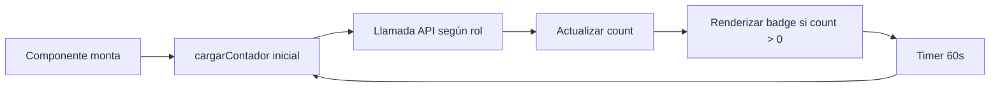

# Sistema de Indicadores de Novedades Pendientes

## 📋 Descripción

Se ha implementado un sistema de indicadores visuales (badges) que muestra en tiempo real el número de novedades pendientes de aprobación para los administradores en el Dashboard y el menú de navegación.

## 🎯 Funcionalidades Implementadas

### 1. **Componente BadgeNovedadesPendientes** 
   - **Ubicación:** `sgturnos-react-app/src/components/novedades/BadgeNovedadesPendientes.jsx`
   - **Propósito:** Badge animado con pulso que muestra el contador de novedades pendientes
   - **Características:**
     - Se actualiza automáticamente cada 60 segundos
     - Color naranja (#ff9500) para diferenciarlo de las alertas de mallas (rojas)
     - Solo se muestra si hay novedades pendientes (count > 0)
     - Se adapta al rol del usuario:
       - **Admin:** Todas las novedades pendientes en cualquier nivel
       - **Jefe Inmediato:** Novedades pendientes de primera aprobación
       - **Operaciones Clínicas:** Novedades pendientes de segunda aprobación
       - **Recursos Humanos:** Novedades pendientes de aprobación final

### 2. **Endpoints Backend (NovedadController.java)**
   Se agregaron 4 nuevos endpoints para contar novedades pendientes:

   ```java
   GET /api/novedades/contar-pendientes-jefe
   GET /api/novedades/contar-pendientes-operaciones
   GET /api/novedades/contar-pendientes-rrhh
   GET /api/novedades/contar-pendientes-admin
   ```

   **Respuesta:** `{ "count": número }`

### 3. **Integración en Dashboard**
   - **Archivo:** `sgturnos-react-app/src/components/Dashboard.jsx`
   - Se agregó el badge junto al título "📋 Novedades"
   - El badge se muestra solo para roles administrativos

### 4. **Integración en Menú de Navegación**
   - **Archivo:** `sgturnos-react-app/src/App.jsx`
   - El badge aparece en el botón "Novedades" del sidebar
   - Se muestra para todos los roles administrativos con diferentes conteos según permisos

## 🔧 Arquitectura Técnica

### Frontend
```jsx
<BadgeNovedadesPendientes rol={user?.rol?.rol} />
```

### Backend
```java
// Lógica de conteo para Admin (evita duplicados con HashSet)
Set<Long> idsUnicos = new HashSet<>();
novedadesJefe.forEach(n -> idsUnicos.add(n.getIdNovedad()));
novedadesOperaciones.forEach(n -> idsUnicos.add(n.getIdNovedad()));
novedadesRRHH.forEach(n -> idsUnicos.add(n.getIdNovedad()));
return Map.of("count", idsUnicos.size());
```

## 🎨 Diseño Visual

- **Color del badge:** Naranja (#ff9500) con fondo sólido
- **Animación:** `animate-pulse` de TailwindCSS
- **Tamaño:** Pequeño (text-xs, px-2 py-1)
- **Posición:** A la derecha del título/texto del botón

## 📊 Flujo de Actualización



## 🚀 Cómo Probar

1. **Crear una novedad de vacaciones:**
   - Iniciar sesión como usuario regular
   - Ir a Novedades > Vacaciones
   - Crear una nueva solicitud

2. **Ver el indicador:**
   - Iniciar sesión como Jefe Inmediato/Admin/Operaciones/RRHH
   - El badge naranja aparecerá en:
     - Botón "Novedades" del menú lateral
     - Título "📋 Novedades" en el Dashboard

3. **Aprobar/Rechazar:**
   - Procesar la novedad desde el panel de revisión
   - El contador se actualizará en máximo 60 segundos (o al refrescar)

## ⚙️ Configuración

### Intervalo de actualización
Para cambiar el intervalo de actualización (por defecto 60 segundos):

```jsx
// En BadgeNovedadesPendientes.jsx, línea ~14
const interval = setInterval(cargarContador, 60000); // Cambiar 60000 (ms)
```

## 📝 Notas Técnicas

- El endpoint para Admin usa un `HashSet` para evitar contar duplicados, ya que una novedad puede estar en múltiples niveles de aprobación
- El componente limpia el interval al desmontarse para evitar memory leaks
- Los errores de API se registran en consola pero no se muestran al usuario (UX sin interrupciones)
- Si el rol del usuario no es administrativo, el badge no se renderiza

## 🔄 Actualización Manual

Los usuarios también pueden actualizar el contador manualmente:
- Botón 🔄 en el panel de Novedades del Dashboard
- Navegando a otra sección y regresando (remonta el componente)

## 🎯 Casos de Uso

1. **Jefe Inmediato:** Ve solo las novedades que están esperando su primera aprobación
2. **Operaciones Clínicas:** Ve novedades que pasaron la aprobación del jefe
3. **Recursos Humanos:** Ve novedades que pasaron las dos primeras aprobaciones
4. **Administrador:** Ve todas las novedades pendientes en cualquier nivel (sin duplicados)

## 📌 Archivos Modificados

### Frontend
- ✅ `sgturnos-react-app/src/components/novedades/BadgeNovedadesPendientes.jsx` (nuevo)
- ✅ `sgturnos-react-app/src/components/Dashboard.jsx` (modificado)
- ✅ `sgturnos-react-app/src/App.jsx` (modificado)

### Backend
- ✅ `sgturnos/src/main/java/com/sgturnos/controller/NovedadController.java` (modificado)

## ✨ Mejoras Futuras

- [ ] Notificaciones push al crear nueva novedad
- [ ] Sonido de alerta al llegar una novedad urgente
- [ ] Diferenciación visual por tipo de novedad (vacaciones, incapacidades, etc.)
- [ ] Tooltip con detalle rápido al pasar el mouse sobre el badge
- [ ] Integración con sistema de notificaciones por correo
